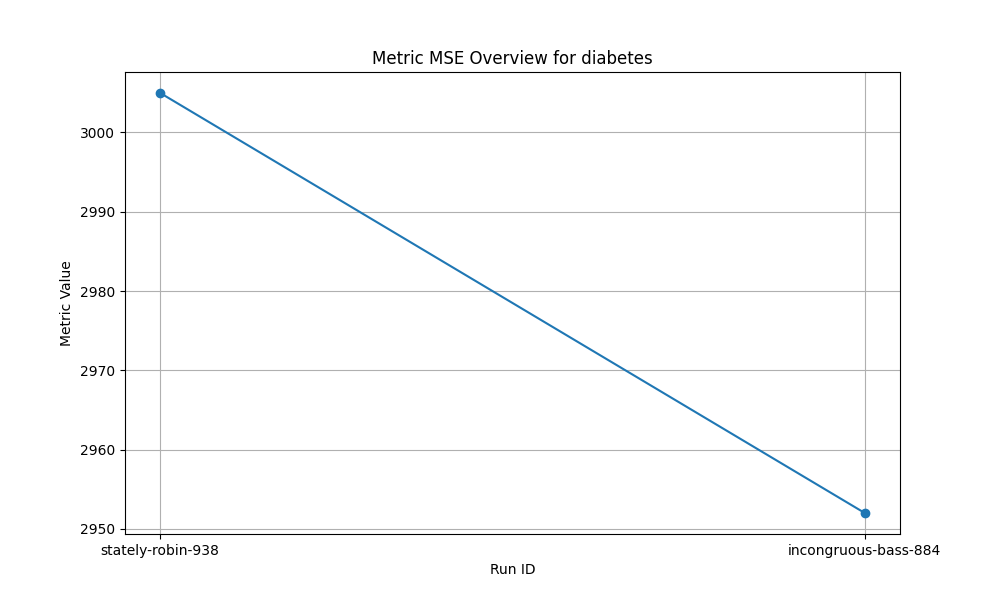
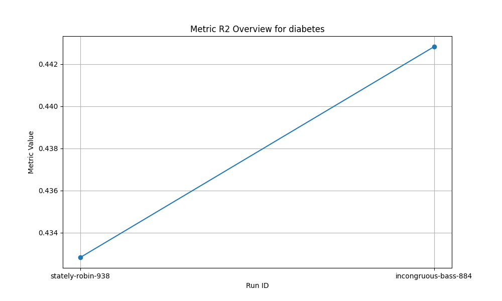

# Часть 2: управление экспериментами с MLflow

## Задача: настроить MLflow для управления экспериментами и их сравнением

### Этапы выполнения

1. Настройка MLflow:

- Настройте MLflow для локальной работы или используйте удаленное хранилище.

- Убедитесь, что все логи и модели сохраняются корректно.

2. Запуск экспериментов:

- Проведите как минимум два эксперимента с разными параметрами моделей.

- Зафиксируйте все метрики экспериментов.

3.Сравнение моделей:

- Используйте MLflow для сравнения двух или более моделей по различным метрикам.

- Постройте отчет о производительности моделей.

4. Документация и отчет:

- Составьте отчет с визуализацией результатов экспериментов, включая графики метрик и выводы.

## Дополнительные заметки

Запуск сервера
mlflow server --backend-store-uri sqlite:///mlflow.db --default-artifact-root ./mlruns

## Отчет
В результате обучения модели машинного обучения на основе RandomForestRegressor с различными параметрами были получены следующие выводы:

1. Run ID: 3d54b4af650a4c05853a17319c78e1e7
    Run Name: stately-robin-938
    Parameters: {'n_estimators': '200', 'max_depth': '10'}
    Metrics: {'mse': 3004.9651817975905, 'r2': 0.432827649257322}

2. Run ID: dd57ae9583bd418ab47b1b7f29e25543
    Run Name: incongruous-bass-884
    Parameters: {'n_estimators': '100', 'max_depth': 'None'}
    Metrics: {'mse': 2952.0105887640448, 'r2': 0.4428225673999313}

А также построены графики:

## Выводы

    Точность модели улучшилась с увеличением параметра  "n_estimators" до 200 и назначения 'max_depth' = 10
